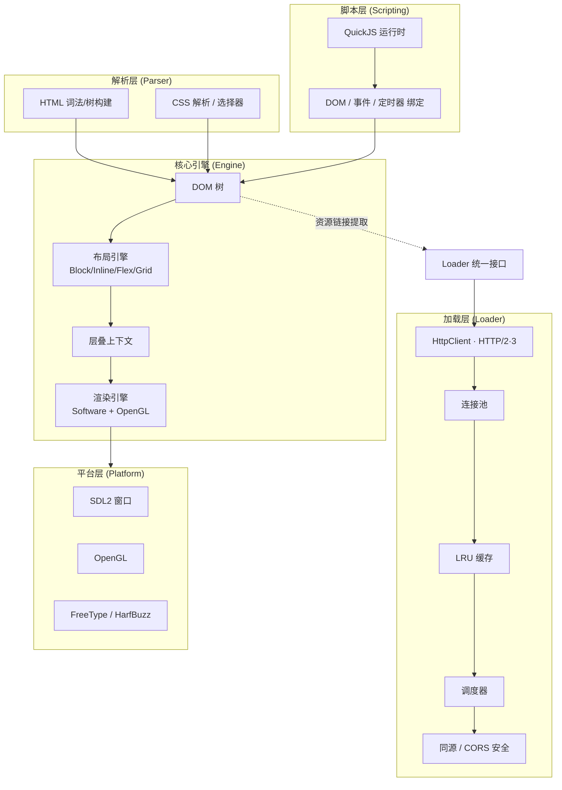

<p align="center">
  
</p>

<h1 align="center">🐧 XiaopengKernel · 小鹏内核</h1>

<p align="center">
  <b>一个从零自研的轻量级浏览器 / HTML 渲染引擎</b><br/>
  用现代 C++20 探索浏览器引擎的完整技术栈
</p>

<p align="center">
  
  
  
  
  
</p>

---

XiaopengKernel 是一个从零开始构建的、自研的轻量级浏览器 / HTML 渲染引擎，使用 C++20 编写。项目的目标是探索并实现现代浏览器引擎的核心技术栈，涵盖 HTML / CSS 解析、CSS Flexbox / Grid 布局排版、GPU（OpenGL）与软件渲染引擎、JavaScript 运行时集成，以及基于异步多线程的资源加载与解析。

> 这是一个极具技术含量的"史诗级"个人 / 小型团队开源项目，架构分层极其清晰，已搭好一个完整且规范的现代浏览器引擎骨架。

## 📑 目录

- [✨ 核心特性](#-核心特性)
- [🏗️ 架构总览](#️-架构总览)
- [📁 项目结构](#-项目结构)
- [🔧 构建与运行](#-构建与运行)
- [🚀 快速上手](#-快速上手)
- [📊 模块进度](#-模块进度)
- [🧪 测试](#-测试)
- [🧭 当前状态与 v1.0 路线图](#-当前状态与-v10-路线图)
- [🗺️ 未来演进计划](#️-未来演进计划)
- [📝 版本历史](#-版本历史)
- [📜 许可证](#-许可证)

## ✨ 核心特性

- 🌐 **HTML / CSS 解析** —— 完整的标记语言解析器，手写词法 / 语法分析器，遵循 WHATWG 规范状态机
- 📐 **CSS 布局引擎** —— Block / Inline / Flexbox / Grid 多种布局模式，含 BFC / IFC 混合排版与自动换行
- 🎨 **层叠上下文** —— 完整的 CSS 层叠规则与 `z-index` 排序（13 种触发条件，7 步绘制顺序）
- 🎮 **双渲染后端** —— OpenGL GPU 加速 + 自研软件光栅化器（Software Rasterizer），支持 PPM 导出
- 🔤 **矢量字体支持** —— FreeType 光栅化 + HarfBuzz 文本整形（Text Shaping）
- ⚡ **多线程解析** —— 主线程事件循环 + 后台 `ParseThread`，支持边下载边解析
- 🧩 **JavaScript 集成** —— QuickJS 轻量级 JS 引擎（ES2020）+ 完整 DOM API、事件、定时器绑定
- 🌍 **网络资源加载** —— HTTP/1.1、HTTP/2、HTTP/3（QUIC）支持，连接池、LRU 缓存、同源策略与 CORS 安全机制

## 🏗️ 架构总览

XiaopengKernel 采用清晰的分层管线设计：输入 HTML 经过解析层构建 DOM / CSSOM，经布局引擎生成布局树，再由渲染引擎绘制到画布，脚本引擎驱动交互，加载层在后台异步获取资源，平台层对接 SDL2 / OpenGL / FreeType。



<!-- 文本环境 / 旧版渲染回退图 -->
```
┌─────────────────────────────────────────────────────────┐
│                    BrowserEngine                         │
├─────────┬─────────┬─────────┬─────────┬─────────────────┤
│   DOM   │   CSS   │ Layout  │ Render  │     Script      │
│  Parser │ Resolver│ Engine  │  Engine │  (QuickJS)      │
├─────────┴─────────┴─────────┴─────────┴─────────────────┤
│                    Loader Layer                          │
│  HttpClient │ ConnectionPool │ Cache │ Scheduler │ Sec   │
├─────────────────────────────────────────────────────────┤
│                  Platform Layer                          │
│      SDL2       │    OpenGL    │    FreeType/HarfBuzz    │
└─────────────────────────────────────────────────────────┘
```

## 📁 项目结构

```
xiaopengkernel/
├── include/            # 头文件目录（68 个 .hpp）
│   ├── css/            # CSS 解析与样式
│   ├── dom/            # DOM 树构建
│   ├── engine/         # 浏览器引擎核心（BrowserEngine / 事件循环 / 浏览上下文）
│   ├── layout/         # 布局算法（Block/Inline/Flex/Grid + 命中测试）
│   ├── loader/         # 资源加载器（HTTP / 缓存 / 连接池 / 调度）
│   ├── network/        # 网络协议层
│   ├── parser/         # HTML / CSS 词法与树构建
│   ├── renderer/       # 渲染引擎（Canvas / 光栅化 / 字体 / 图像）
│   ├── script/         # JS 脚本绑定（DOM / 事件 / 定时器 / Promise）
│   └── window/         # 窗口管理（SDL2 / 鼠标事件）
├── src/                # 源代码（20 个 .cpp）
├── tests/              # 单元测试（23 个测试文件，100+ 用例）
├── demo/               # 演示页面（flexbox / grid / image / showcase）
├── docs/               # API 文档（Loader / DOM / 脚本引擎）
├── third_party/        # 第三方依赖（curl / SDL2 / FreeType / HarfBuzz / QuickJS）
├── CMakeLists.txt      # 构建系统
└── LICENSE             # CAOSL v2.0 许可证
```

## 🔧 构建与运行

### 前置依赖

XiaopengKernel 将 curl、SDL2、FreeType、HarfBuzz、QuickJS 等依赖打包在 `third_party/` 中（Windows / MinGW 开箱即用）。你只需要：

- **CMake 3.15+**
- **C++20 兼容编译器**：GCC 11+ / Clang 14+ / MSVC 2019+
- （Windows / MinGW）无需额外安装，依赖已内置
- （Linux）需系统提供 `libcurl`、`libsdl2`、`libfreetype`、`libharfbuzz` 开发包

> 构建系统会自动探测并启用 SDL2、FreeType/HarfBuzz、OpenGL、QuickJS；缺失时自动降级（例如无窗口环境时回退到 PPM 导出 / Headless 模式）。

### 构建步骤

```bash
# 创建并进入构建目录
mkdir build && cd build

# 生成构建文件
cmake ..

# 编译（可加 -j 并行）
cmake --build . -j4
```

### 运行

```bash
# 运行默认交互式 Demo（带 GUI 窗口）
./bin/xiaopengkernel

# 加载指定本地 HTML 文件
./bin/xiaopengkernel path/to/page.html

# 运行极简演示（无 SDL 依赖，自动导出渲染结果）
./bin/xiaopengkernel --minimal-demo

# 运行单元测试套件
ctest .
```

常用 CMake 自定义目标：`make run`（运行引擎）、`make run_tests`（运行 loader 测试）、`make minimal_demo`（极简演示）。

## 🚀 快速上手

下面的最小示例展示了如何用 `BrowserEngine` 一行加载 HTML 并进入交互事件循环：

```cpp
#include <engine/browser_engine.hpp>

int main() {
    xiaopeng::engine::BrowserEngine engine;
    xiaopeng::engine::BrowserEngine::Config cfg;
    cfg.title = "My First Page";

    if (!engine.initialize(cfg)) return 1;

    // 直接加载 HTML 字符串（自动提取并应用内联 CSS / JS）
    engine.loadHTML(R"(
        <html>
          <body>
            <h1 style="color:#e91e63">Hello XiaopengKernel</h1>
            <div id="box" style="width:120px;height:120px;background:#2196f3"></div>
            <script>
              document.getElementById("box").addEventListener("click", function () {
                console.log("clicked!");
              });
            </script>
          </body>
        </html>
    )");

    return engine.run();   // 阻塞直至窗口关闭
}
```

加载外部资源时，引擎会自动下载 `<link rel="stylesheet">` 与 `<script src>`，并通过 Loader 模块解析相对路径（支持 `<base>` 标签、`Config::baseUrl` 与文件路径推导）。更多 API 见 [`docs/API.md`](docs/API.md)。

## 📊 模块进度

| 模块 | 状态 | 说明 |
|------|------|------|
| **HTML 解析器** | ✅ 完整 | WHATWG 规范状态机，65 个解析状态，字符引用解码 |
| **CSS 解析器** | ✅ 基础 | 选择器解析、属性选择器、伪类 / 伪元素 |
| **DOM 树** | ✅ 完整 | Element / Document / TextNode / Comment 及完整 API |
| **布局引擎** | ✅ 进阶 | Block / Inline / Flexbox / Grid，BFC / IFC 混合排版 |
| **层叠上下文** | ✅ 完整 | CSS 2.1 层叠规则，z-index 排序，PaintLayer 图层管理 |
| **渲染引擎** | ✅ 进阶 | 软件渲染 + OpenGL GPU 加速，FreeType + HarfBuzz 字体 |
| **JS 引擎** | ✅ 集成 | QuickJS + DOM / 事件 / 定时器 / Promise 绑定 |
| **网络加载** | ✅ 完整 | HTTP/1.1·2·3，连接池，LRU 缓存，同源 / CORS 安全 |
| **事件系统** | ✅ 进阶 | 捕获 / 目标 / 冒泡三阶段事件流，命中测试（Hit Testing） |
| **事件循环** | ✅ 进阶 | WHATWG 事件循环、浏览上下文、页面生命周期 |

### 核心模块详解

**1. HTML / CSS 解析**
- 完整 WHATWG 规范 HTML 词法分析器（65 个状态）+ 树构建器（23+ 插入模式）
- CSS 选择器：Tag、Class、Id、Attribute、Pseudo-class、Pseudo-element
- 属性选择器运算符：`=`、`~=`、`|=`、`^=`、`$=`、`*=`
- 伪类：`:first-child`、`:last-child`、`:nth-child`、`:first-of-type`、`:lang()`、`:not()` 等

**2. 布局引擎**
- Block 布局：完整盒模型，margin / padding / border 计算，BFC 隔离
- Inline 布局：Line Box Model、文本自动换行、垂直对齐
- Flexbox：`flex-direction`、`justify-content`、`align-items` 等
- Grid：`grid-template`、`grid-area`（基础实现）
- 层叠上下文：13 种触发条件，7 步绘制顺序

**3. 渲染引擎**
- 软件渲染：基于像素缓冲的 Canvas，自研光栅化器，支持抗锯齿
- OpenGL 渲染：GPU 加速，帧缓冲区管理
- 矢量字体：FreeType 光栅化 + HarfBuzz 文本整形
- 图层管理：PaintLayer 支持负 / 正 z-index 分组

**4. JavaScript 集成（QuickJS）**
- Document API：`body` / `head` / `title` / `URL` / `readyState`、资源提取
- 创建方法：`createElement` / `createTextNode` / `createDocumentFragment`
- Node 遍历：`parentNode` / `childNodes` / `children` / `nextSibling`
- classList API：`add` / `remove` / `toggle` / `contains` / `replace`
- DOM 操作：`insertBefore` / `replaceChild` / `remove` / `cloneNode`
- 事件：`addEventListener` / `removeEventListener` / `dispatchEvent`
- 定时器：`setTimeout` / `setInterval` / `clearTimeout` / `clearInterval`

**5. 网络加载**
- HTTP/1.1、HTTP/2、HTTP/3（QUIC）协议支持
- 连接池管理（每主机最大连接、总连接上限、空闲回收）
- LRU 缓存策略（Cache-Control、ETag 验证）
- 安全策略：Same-Origin、CORS、Mixed Content 拦截

## 🧪 测试

项目包含 **100+** 单元测试用例，覆盖解析、布局、渲染、脚本与加载全链路。测试通过 CMake + CTest 管理：

| 测试文件 | 覆盖范围 |
|----------|----------|
| `test_dom_binding.cpp` | Document / Element / Node / classList 全 API（40+ 用例） |
| `test_phase2_selectors_stacking.cpp` | 属性选择器 + 伪类 + 层叠上下文（27 用例） |
| `test_html_parser.cpp` | HTML 词法 / 树构建 |
| `test_css_parser.cpp` | CSS 选择器 / 属性解析 |
| `test_style_resolver.cpp` | 样式计算与层叠优先级 |
| `test_flexbox.cpp` / `test_flexbox_advanced.cpp` | Flexbox 布局 |
| `test_grid.cpp` | Grid 布局 |
| `test_positioning.cpp` | 定位 |
| `test_stacking.cpp` | 层叠上下文绘制顺序 |
| `test_ifc.cpp` | Inline 格式化上下文 / 文本排版 |
| `test_incremental.cpp` | 增量重排 / 重绘 |
| `test_event.cpp` / `test_event_loop.cpp` | 事件系统 / 事件循环 |
| `test_page_lifecycle.cpp` | 页面生命周期 |
| `test_parse_thread.cpp` | 后台多线程解析 |
| `test_resource_tree.cpp` | 资源树管理 |
| `test_renderer.cpp` / `test_layout.cpp` | 渲染 / 布局绘制路径 |
| `test_gpu_acceleration.cpp` / `test_opengl.cpp` | OpenGL GPU 加速 |
| `loader_tests` | 网络 / 缓存 / 连接池 / 调度（聚合套件） |

运行全部测试：

```bash
cd build && ctest . --output-on-failure
```

## 🧭 当前状态与 v1.0 路线图

> 以下评估基于对源码（约 2 万行核心 C++，不含 QuickJS 等第三方依赖）的静态分析，详见 [`analysis_results.md`](analysis_results.md)。

项目已搭建一个非常完整且规范的现代浏览器引擎骨架，但距离能渲染大部分现代网页（如简单 Vue / React 站点）的"正式版"仍需填补以下核心差距：

**高优先级（v1.0 阻塞项）**
1. **内联排版系统重构（IFC 完善）**：实现完整 Line Box Model，处理断行、内联块与 `vertical-align`，使图文混排正常显示。
2. **盒模型与浮动（Floats & Stacking）**：完善层叠树（`RenderTree` / `PaintTree`）的 z-index 深度排序，支持脱离文档流的 `float`。
3. **DOM 事件流完善**：完整实现标准 DOM 事件规范（捕获 / 目标 / 冒泡），并在 C++ 与 QuickJS 间妥善管理监听器生命周期（循环引用）。

**中优先级（Beta 特性）**
- 复杂选择器与样式继承（`:hover`、`:active`、`::before`、`inherit`）
- 异步网络流（Streaming Parsing，边下载边解析边渲染）
- Web API 补全：`fetch`、微任务队列、`XMLHttpRequest`

**粗略工期预估（单人全职）**

| 阶段 | 里程碑 | 预估工期 |
| :--- | :--- | :--- |
| **Alpha** | Acid1 测试及格；完善 IFC、层叠上下文、`display:flex` 剩余用例 | 1.5 – 2 个月 |
| **Beta** | 可交互；JS 闭包 GC 与 DOM 事件流，跑通微型交互式 JS | 1 – 2 个月 |
| **v1.0** | 框架支持；引入 Fetch API 与微任务队列，渲染极简版 Vue 3 | 2 – 3 个月 |

总结：距离一个"极简但在真实世界能跑"的正式版，大约还差 **5 – 7 个月** 的集中开发量。

## 🗺️ 未来演进计划

- **阶段 1–3（部分完成 ✅）**：JavaScript DOM API 绑定、高级 CSS 选择器与层叠上下文、W3C 三阶段事件流与窗口 UI 事件分发
- **阶段 4**：渲染树解耦与增量重排 / 重绘（脏标记 Dirty Bits 跟踪）
- **阶段 5**：高级布局（完善 CSS Grid、Bidi 双向文本、BFC 隔离）
- **阶段 6**：浏览上下文与网络层（History API、HTTP/2 Server Push、Service Worker）
- **阶段 7**：事件循环与页面生命周期（对齐 WHATWG Event Loop、`requestAnimationFrame` 对齐 VSync）
- **阶段 8**：Web API 扩展（Canvas 2D、`fetch` / `XMLHttpRequest`、Web Workers）
- **阶段 9**：硬件加速合成器（Layer 树、独立合成器线程、瓦片化光栅化）
- **阶段 10**：开发者工具（Chrome DevTools Protocol、Inspector UI、Performance 面板）

## 📝 版本历史

- **v0.4.0（开发中 · JavaScript 引擎）**：集成 QuickJS 引擎核心，实现 `ScriptEngine` 封装，支持执行 JavaScript，完善 C/C++ 混合编译与事件循环集成（Promise 绑定）。
- **v0.3.0（交互式窗口）**：完成布局引擎与渲染模块；集成 SDL2 交互式窗口，支持实时位图渲染与事件循环、Headless 自动降级；自研软件光栅化器、PPM 导出、VGA 点阵字体；100+ 单元测试。
- **v0.2.0（HTML 解析器）**：完成 HTML5 词法分析器（50+ 状态、字符引用解码）、DOM 树构建器（23 种插入模式）、DOM 节点系统；79 个单元测试。
- **v0.1.0（网络与资源加载）**：完成 Loader 层，支持 HTTP/1.1 与 HTTP/2、资源缓存、连接池、同源策略与 CORS；44 个单元测试。

## 📜 许可证

本项目基于 **JENCAO Custom Advanced Open Source License v2.0 (CAOSL v2.0)** 开源，版权归属 Jinpeng Cao (jencao)。

该许可证为强 copyleft 自定义开源协议，平衡了源码披露、专利保护、伦理使用限制与商业灵活性：修改或衍生作品在分发时必须以相同（或实质等同）许可证公开完整源码，且不得集成进专有 / 闭源商业软件。完整条款见 [`LICENSE`](LICENSE)。
